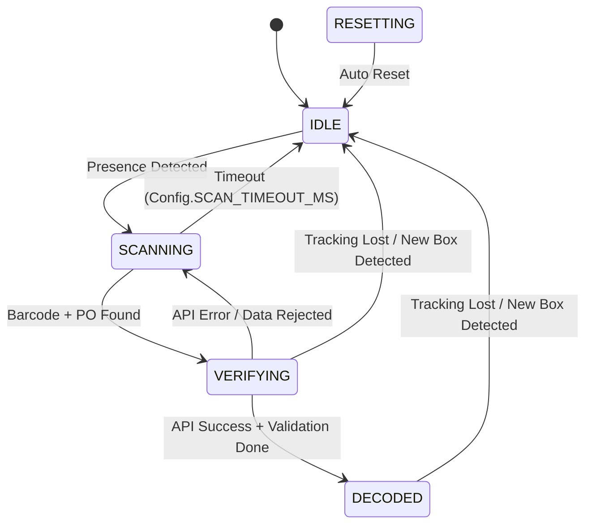
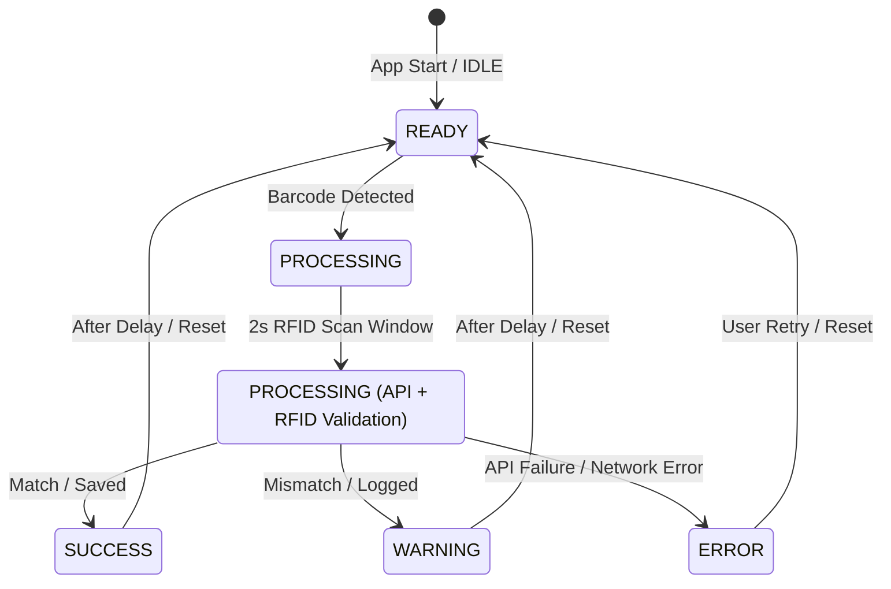

# 📊 ARCHITECTURE DIAGRAMS

## 🏗️ System Architecture Overview

```
┌─────────────────────────────────────────────────────────────────────┐
│                         📱 PRESENTATION LAYER                        │
│  ┌───────────────────────────────────────────────────────────────┐  │
│  │                        DemoFragment                           │  │
│  │  • UI Orchestration (Camera + RFID)                           │  │
│  │  • 500ms RFID Scanning Window logic                           │  │
│  │  • Lifecycle & Camera Management                              │  │
│  └─────────────────────────────┬─────────────────────────────────┘  │
│                                │                                    │
│  ┌─────────────────────────────▼─────────────────────────────────┐  │
│  │                        BoxProcessor                           │  │
│  │  ┌──────────────┐  ┌──────────────┐  ┌─────────────────────┐  │  │
│  │  │BarcodeDecoder│  │ POExtractor  │  │   TrackingManager   │  │  │
│  │  └──────────────┘  └──────────────┘  └─────────────────────┘  │  │
│  │  ┌──────────────┐  ┌──────────────┐  ┌─────────────────────┐  │  │
│  │  │BlurDetector  │  │PresenceDet.  │  │   OCR Fusion        │  │  │
│  │  └──────────────┘  └──────────────┘  └─────────────────────┘  │  │
│  └─────────────────────────────┬─────────────────────────────────┘  │
│                                │                                    │
│  ┌─────────────────────────────▼─────────────────────────────────┐  │
│  │                      ViewModels                                │  │
│  │  ┌─────────────────────────┐     ┌─────────────────────────┐   │  │
│  │  │      MainViewModel      │     │      RfidViewModel      │   │  │
│  │  │  • Global State         │<───>│  • Hardware connection  │   │  │
│  │  │  • Data persistence     │     │  • Best EPC calculation │   │  │
│  │  │  • UI Event bus         │     │  • RFID API calls       │   │  │
│  │  └─────────────────────────┘     └─────────────────────────┘   │  │
│  └────────────────────────────────────────────────────────────────┘  │
└───────────────────────────────────────┬─────────────────────────────┘
                                        │
┌───────────────────────────────────────▼─────────────────────────────┐
│                          🎯 DOMAIN LAYER                             │
│  ┌────────────────────────────────────────────────────────────────┐ │
│  │                        Use Cases                               │ │
│  │  ┌─────────────────────────────────────────────────────────┐  │ │
│  │  │  ProcessCameraWithRfidUseCase                           │  │ │
│  │  │  • Main entry point for save logic                      │  │ │
│  │  │  • Orchestrates validation if RFIDs present             │  │ │
│  │  │  • Fallback to normal save if no RFIDs                  │  │ │
│  │  └──────────────────────────┬──────────────────────────────┘  │ │
│  │                             │                                  │ │
│  │  ┌──────────────────────────▼──────────────────────────────┐  │ │
│  │  │  ValidateWithRfidUseCase                                │  │ │
│  │  │  1. Fetch RFID info from API                            │  │ │
│  │  │  2. Deep comparison (PO, Size, Art, UPC)                │  │ │
│  │  │  3. Save to Main (Match) or Mismatch table              │  │ │
│  │  └─────────────────────────────────────────────────────────┘  │ │
│  └────────────────────────────────────────────────────────────────┘ │
└───────────────────────────────────────┬─────────────────────────────┘
                                        │
┌───────────────────────────────────────▼─────────────────────────────┐
│                          💾 DATA LAYER                               │
│  ┌────────────────────────────────────────────────────────────────┐ │
│  │                      Repositories                              │ │
│  │  ┌──────────────────────────────────────────────────────────┐ │ │
│  │  │  ShoeboxRepository                                       │ │ │
│  │  │  • processScan(po, barcode)                             │ │ │
│  │  │  • saveToMainTable() / saveToMismatchTable()            │ │ │
│  │  │  • syncData() -> Direct Background Sync                  │ │ │
│  │  └──────────────────────────────────────────────────────────┘ │ │
│  │  ┌──────────────────────────────────────────────────────────┐ │ │
│  │  │  RfidRepository                                          │ │ │
│  │  │  • getRfidInfo(rfidCode) -> Result<RfidData>             │ │ │
│  │  └──────────────────────────────────────────────────────────┘ │ │
│  └─────────────────────────────┬──────────────────────────────────┘ │
│                                  │                                    │
│  ┌─────────────────────────────▼──────────────────────────────────┐ │
│  │                      Data Sources                              │ │
│  │  ┌──────────────┐  ┌──────────────┐  ┌────────────────────┐  │ │
│  │  │ ShoeboxDao   │  │ PoApiService │  │ NetworkMonitor     │  │ │
│  │  │ (Room)       │  │ (Retrofit)   │  │ (Connectivity)     │  │ │
│  │  └──────────────┘  └──────────────┘  └────────────────────┘  │ │
│  └────────────────────────────────────────────────────────────────┘ │
└─────────────────────────────────────────────────────────────────────┘
```

---

## 🔄 Data Flow Sequence Diagrams

### Flow 1: Camera Scan WITH RFID Validation (Match)

```
User        DemoFragment    BoxProcessor    API (PO)      RfidReader    MainVM/UseCase   API (RFID)      DB
 │               │               │              │             │               │              │           │
 │ Box detected  │               │              │             │               │              │           │
 ├──────────────>│ updateLogic() │              │             │               │              │           │
 │               ├──────────────>│ State:       │             │               │              │           │
 │               │               │ SCANNING     │             │               │              │           │
 │ Decoded OK    │               │              │             │               │              │           │
 │               │<──────────────┤ (Tracking)   │             │               │              │           │
 │               │               │              │             │               │              │           │
 │               │ getPoDetails()│              │             │               │              │           │
 │               ├─────────────────────────────>│             │               │              │           │
 │               │   200 OK      │              │             │               │              │           │
 │               │<─────────────────────────────┤             │               │              │           │
 │               │               │              │             │               │              │           │
 │               │ 🕒 Start 500ms RFID Window   │             │               │              │           │
 │               ├───────────────────────────────────────────>│               │              │           │
 │               │               │              │             │               │              │           │
 │ Tags found    │               │              │             │   onTagRead() │              │           │
 │               │<───────────────────────────────────────────┤               │              │           │
 │               │               │              │             │               │              │           │
 │ 🕒 Window End │               │ saveScanData(setOfRFIDs)     │             │               │              │
 │               ├───────────────────────────────────────────>│ invoke()      │              │           │
 │               │               │              │             │               │ getRfidInfo()│           │
 │               │               │              │             │               ├─────────────>│           │
 │               │               │              │             │               │   200 OK     │           │
 │               │               │              │             │               │<─────────────┤           │
 │               │               │              │             │               │              │           │
 │               │               │              │             │               │ compareData()│           │
 │               │               │              │             │               │ ✅ MATCH    │           │
 │               │               │              │             │               │ saveMain()   │           │
 │               │               │              │             │               ├─────────────────────────>│
 │               │               │              │             │               │              │           │
 │               │  ValidationResult: SUCCESS   │             │               │              │           │
 │               │<───────────────────────────────────────────┤               │              │           │
 │               │               │              │             │               │              │           │
 │ Show Success  │ onApiVerif(T) │              │             │               │              │           │
 │               ├──────────────>│ State:       │             │               │              │           │
 │<──────────────┤               │ DECODED      │             │               │              │           │
 │               │               │              │             │               │              │           │
```

### Flow 2: Camera Scan WITH RFID Validation (Mismatch)

```
[Similar to Flow 1 until compareData()]

 │               │               │              │             │               │ compareData()│           │
 │               │               │              │             │               │ ⚠️ MISMATCH │           │
 │               │               │              │             │               │ saveMismatch()           │
 │               │               │              │             │               ├─────────────────────────>│
 │               │               │              │             │               │ (Store both Cam & RFID)  │
 │               │  ValidationResult: MISMATCH  │             │               │                          │
 │               │<───────────────────────────────────────────┤               │                          │
 │               │               │              │             │               │                          │
 │ Show Warning  │ onApiVerif(T) │              │             │               │                          │
 │               ├──────────────>│ State:       │             │               │                          │
 │<──────────────┤               │ DECODED      │             │               │                          │
 │               │               │              │             │               │                          │
```

### Flow 3: Camera Scan WITHOUT RFID (Reader Offline or No Tags)

```
User        DemoFragment    BoxProcessor    API (PO)      RfidReader    MainVM/UseCase       DB
 │               │               │              │             │               │              │
 │ Decoded OK    │               │              │             │               │              │
 │               │ getPoDetails()│              │             │               │              │
 │               ├─────────────────────────────>│             │               │              │
 │               │   200 OK      │              │             │               │              │
 │               │<─────────────────────────────┤             │               │              │
 │               │               │              │             │               │              │
 │               │ 🕒 Start 2s RFID Window      │             │               │              │
 │               ├───────────────────────────────────────────>│               │              │
 │               │               │              │             │               │              │
 │ 🕒 Window End │ (No tags)     │              │             │               │              │
 │               │ saveScanData(emptySet)       │             │               │              │
 │               ├───────────────────────────────────────────>│ invoke()      │              │
 │               │               │              │             │               │ No RFIDs ->  │
 │               │               │              │             │               │ saveMain()   │
 │               │               │              │             │               ├─────────────>│
 │               │               │              │             │               │              │
 │ Show Success  │ onApiVerif(T) │              │             │               │              │
 │               ├──────────────>│ State:       │             │               │              │
 │<──────────────┤               │ DECODED      │             │               │              │
```

### Flow 4: Offline Mode (API Failure)

```
User          DemoFragment    UseCases         Repository      Database      API
 │                 │              │                │              │            │
 │ Scan Barcode    │              │                │              │            │
 ├────────────────>│              │                │              │            │
 │                 │ processScan()│                │              │            │
 │                 ├─────────────>│              │            │
 │                 │              │ processScan()  │              │            │
 │                 │              ├───────────────>│              │            │
 │                 │              │                │ GET /select-po│            │
 │                 │              │                ├─────────────────────────>│
 │                 │              │                │              │  ❌ TIMEOUT│
 │                 │              │                │<─────────────────────────┤
 │                 │              │                │ getLocalData()│            │
 │                 │              │                ├─────────────>│            │
 │                 │              │                │  Query cache │            │
 │                 │              │                │<─────────────┤            │
 │                 │              │  Result.Success(cached)       │            │
 │                 │<─────────────┤                │              │            │
 │                 │              │ saveToMainTable()             │            │
 │                 ├───────────────────────────────>│              │            │
 │                 │              │                │ insertDetail()│            │
 │                 │              │                ├─────────────>│            │
 │                 │              │                │  Synced = 0  │  (Will sync later)
 │  showOffline() │              │                │              │            │
 │  "📴 Offline"  │              │                │              │            │
 │<────────────────┤              │                │              │            │
```

### Flow 5: Background Sync (WorkManager)

```
WorkManager    SyncWorker    SyncUseCase    Repository      Database      API
    │              │              │              │              │            │
    │ Periodic     │              │              │              │            │
    │ Trigger      │              │              │              │            │
    │ (15 min)     │              │              │              │            │
    ├─────────────>│              │              │              │            │
    │              │ doWork()     │              │              │            │
    │              ├─────────────>│              │              │            │
    │              │              │ syncPending()│              │            │
    │              │              ├─────────────>│              │            │
    │              │              │              │ getUnsynced()│            │
    │              │              │              ├─────────────>│            │
    │              │              │              │ [item1, item2]            │
    │              │              │              │<─────────────┤            │
    │              │              │              │              │            │
    │              │              │              │ POST /sync/detail         │
    │              │              │              ├─────────────────────────>│
    │              │              │              │              │  200 OK    │
    │              │              │              │<─────────────────────────┤
    │              │              │              │ updateSynced()│            │
    │              │              │              ├─────────────>│            │
    │              │              │              │  Synced = 1  │            │
    │              │              │              │              │            │
    │              │              │              │ POST /sync/rfid-mismatch  │
    │              │              │              ├─────────────────────────>│
    │              │              │              │              │  200 OK    │
    │              │              │              │<─────────────────────────┤
    │              │              │              │ updateRfidSynced()        │
    │              │              │              ├─────────────>│            │
    │              │              │  Result.Success(SyncStats)  │            │
    │              │<─────────────┤              │              │            │
    │              │ Result.success()            │              │            │
    │<─────────────┤              │              │              │            │
    │              │              │              │              │            │
```

---

## 📊 Database Schema Diagram

```
┌─────────────────────────────────────────────────────────────┐
│               Data_Shoebox_Detail (Main Table)              │
│─────────────────────────────────────────────────────────────│
│ id (PK)              │ BIGINT AUTO_INCREMENT                │
│ RY                   │ TEXT                                 │
│ Size                 │ TEXT                                 │
│ PO                   │ TEXT                                 │
│ UPC                  │ TEXT                                 │
│ Qty                  │ INT                                  │
│ DateScan             │ TEXT (yyyy-MM-dd HH:mm:ss)           │
│ Modify               │ TEXT                                 │
│ Article              │ TEXT                                 │
│ ShoeImage            │ TEXT                                 │
│ User_Serial_Key      │ TEXT                                 │
│ Line                 │ TEXT                                 │
│ Synced               │ INT (0 = No, 1 = Yes)               │
└─────────────────────────────────────────────────────────────┘
                            ↑
                            │ Used when:
                            │ • No RFID tags found in scan window
                            │ • Best RFID match matches Camera data
                            │
┌─────────────────────────────────────────────────────────────┐
│         Data_Shoebox_RFID_Detail (Mismatch Table)           │
│─────────────────────────────────────────────────────────────│
│ id (PK)              │ BIGINT AUTO_INCREMENT                │
│                                                             │
│ ┌─── Camera Snapshot ───────────────────────────────────┐  │
│ │ RY / Size / PO / UPC / Qty / Article                  │  │
│ └───────────────────────────────────────────────────────┘  │
│                                                             │
│ ┌─── RFID Snapshot (Best EPC) ──────────────────────────┐  │
│ │ RFID / Size_RFID / PO_RFID / UPC_RFID / Article_RFID  │    │
│ └───────────────────────────────────────────────────────┘  │
│                                                             │
│ MismatchFields       │ TEXT (JSON: ["PO", "Size"])         │
│ DateScan             │ TEXT                                 │
│ Synced               │ INT                                  │
└─────────────────────────────────────────────────────────────┘
                            ↑
                            │ Used when:
                            │ • Best RFID tag does NOT match camera data
                            │
┌─────────────────────────────────────────────────────────────┐
│             Data_Shoebox_Total (Current Day Summary)        │
│─────────────────────────────────────────────────────────────│
│ PO / UPC / Size / DateScan / Total_Qty_Scan / Total_Qty_ERP │
└─────────────────────────────────────────────────────────────┘
```

---

## 🔄 State Machine Diagrams

### BoxProcessor State Machine (Processing Logic)
This state machine runs at the frame-processing level (~20 FPS).



### UI Processing State (MainViewModel)
This state transition is driven by `liveData` observations.



---

**📌 These diagrams provide a comprehensive guide to the current system state, ensuring technical alignment between documentation and the Kotlin implementation.**
